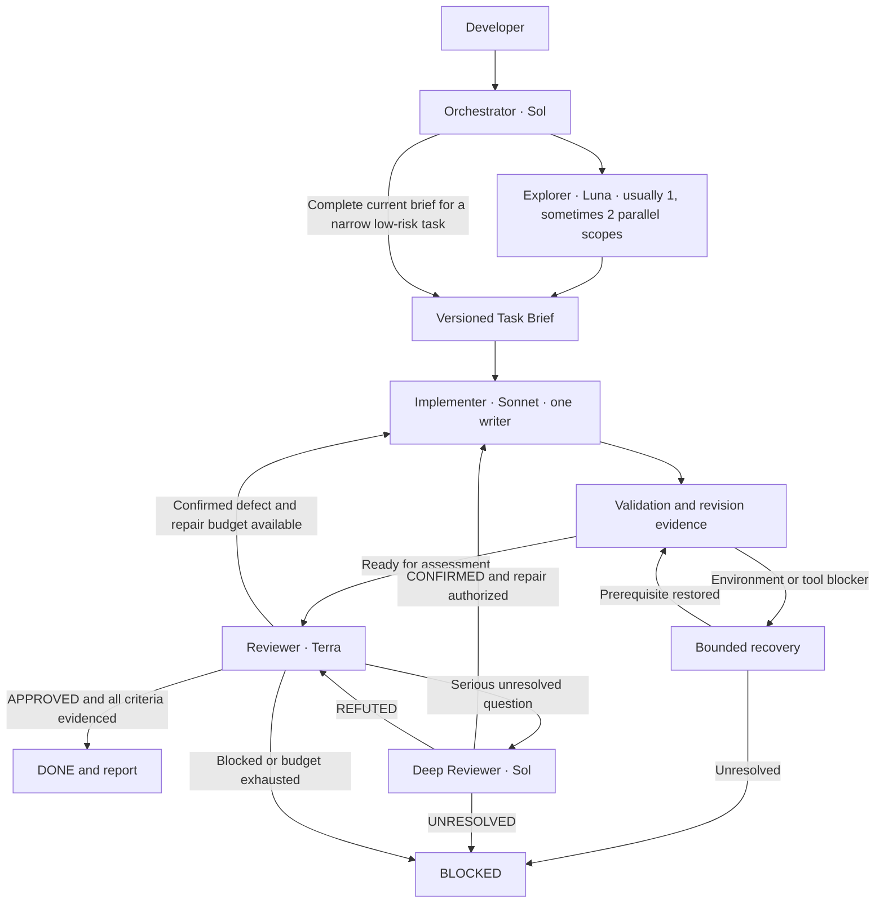

# Copilot Engineering Team v2

A GitHub Copilot configuration for VS Code and existing **FastAPI + React/Next.js + TypeScript** applications. This repository contains configuration, validation and demonstration material, not application code.

V2 keeps five roles and adds a shared Task Brief, revision-bound evidence, explicit blockers, bounded recovery and observable routing. One role writes; independent review decides whether the complete change is acceptable.



Arrows describe the workflow: Orchestrator performs all delegation. Investigation-only and review-only requests use their own shorter routes. Validation normally runs inside the implementation invocation. A deep result never approves the full change.

## Components

| Component | Purpose |
| --- | --- |
| [Shared instructions](.github/copilot-instructions.md) | Architecture, evidence reuse and safety |
| [Path instructions](.github/instructions/) | Backend, frontend and test conventions |
| [Agents](.github/agents/) | Five roles and minimal tool sets |
| [Workflow contract](.github/agents/contracts/workflow.md) | Task Brief, result formats, revision evidence, severity and statuses |
| [Skills](.github/skills/) | Analysis, investigation, validation and review procedures |
| [Prompts](.github/prompts/) | Feature, investigation and review entry points |
| [Settings](.vscode/settings.json) | No terminal auto-approval or nested delegation |
| [Validator](scripts/validate_config.py) and [tests](tests/test_validate_config.py) | Static contract regression checks |
| [CI](.github/workflows/validate-config.yml) | Run static checks on Python 3.10 and 3.12 |
| [Demo](docs/demo.md) and [scorecard](docs/demo-scorecard.md) | Runtime checks and an evidence-led presentation |
| [Observability](docs/observability.md) | Local traces, model routing and cost evidence |
| [Benchmark](docs/benchmark.md) and [worksheet](docs/benchmark-results.csv) | Repeatable measurements, initially NOT_RUN |
| [Experiments](docs/experiments.md) | Optional cheaper-model trials; no production routing changes |

## Install or upgrade in an application

1. Open the application root with Copilot and the required models available.
2. Merge only these distributable paths: `.github/copilot-instructions.md`, `.github/instructions/`, `.github/agents/` (including `contracts/`), `.github/skills/`, and `.github/prompts/`. Preserve existing rules and customizations. Do not copy this template's maintenance workflow unless also adopting its scripts, tests and documentation.
3. Replace the template architecture bullet with real application directories. Adapt path globs and conventions; FastAPI rules apply only where those libraries are used. Record known validation commands and cwd from actual manifests.
4. Merge the two [settings](.vscode/settings.json). Use standard approvals rather than Bypass Approvals/Autopilot. Organization policy takes precedence.
5. Check model names through VS Code suggestions and actual invocations. All configured fallbacks are initially disabled; adapting the model policy requires a conscious configuration change and runtime verification.
6. Select **Orchestrator**, whose only tool is `agent`. Other roles are hidden from the picker. If the shared contract is not injected into context, its first Explorer/Reviewer returns coordination rules alongside ordinary findings. This requires no separate bootstrap call.
7. Run the [first-run scenarios](docs/demo.md) after installation, changes to models/tools, or a harness upgrade. Do not repeat setup checks for every task.

V1 migration replaces role/skill/prompt contents, adds the shared contract and removes Orchestrator's read/search tools. Keep the existing two approval settings. No new agent or Test Agent is needed.

Custom-agent availability depends on the account, client and organization. Verify discovery and effective tools in Chat diagnostics. [Custom agents](https://code.visualstudio.com/docs/agent-customization/custom-agents).

Prompt files work with local extension-host agents; Agent Host sessions do not use them. There, select Orchestrator and enter the full request. Do not assume a slash command ran the team. [Prompt files](https://code.visualstudio.com/docs/agent-customization/prompt-files).

## Usage

With Orchestrator selected:

```text
Add filtering by validation status in the API and UI.
Omitting the filter must preserve existing behavior.
Changing the filter must reset pagination.
Cover meaningful backend and frontend behavior with tests.
```

Where prompt files are supported:

```text
/implement-feature Add status filtering while preserving API compatibility.
/investigate-bug Changing a filter on page two returns an empty list. Diagnose only.
/review-change Review the current working-tree status-filter changes without fixes.
```

Skills are procedures, not additional roles or tool grants. A command requiring execution is delegated to an execution-capable role.

## Models, context and credits

| Role | Default model | Tools |
| --- | --- | --- |
| Orchestrator | GPT-5.6 Sol | agent |
| Explorer | GPT-5.6 Luna | read, search |
| Implementer | Claude Sonnet 5 | read, search, edit, execute |
| Reviewer | GPT-5.6 Terra | read, search, execute |
| Deep Reviewer | GPT-5.6 Sol | read, search, execute |

A subagent cannot exceed its parent's cost tier. Keeping Sol supports the full configured chain, including deep review; changing the coordinator to Luna is not an equivalent cheaper configuration. Invocations are stateless, so repairs need the relevant prior brief and delta. [Subagents](https://code.visualstudio.com/docs/agents/run/subagents).

Prefer Luna for scoped exploration, compact sourced handoffs, reuse of applicable checks, and fewer unnecessary invocations. Parallelism can reduce latency while increasing token usage. Independent Reviewer reads are useful verification, not automatically waste.

Fallback lists are availability preferences, not automatic recovery after partial writes. Before enabling one, smoke-test it, add it to `APPROVED_FALLBACKS` and `MODEL_TIERS` in the validator, then configure at most one alternative in that role's model list. Every possible parent must support the entire child chain; every possible reviewer/deep-reviewer model must differ from every possible implementer model. No fallback is pre-approved in v2.

Use actual Copilot account/session usage, not guessed request multipliers or agent self-reports. Current token/cache pricing is maintained by GitHub; this template does not hardcode prices. [Copilot pricing](https://docs.github.com/en/copilot/reference/copilot-billing/models-and-pricing).

## Completion and safety

The [contract](.github/agents/contracts/workflow.md) distinguishes confirmed defects (CHANGES REQUIRED), unavailable required evidence (BLOCKED), and serious unresolved questions (DEEP REVIEW REQUIRED). DONE requires all criteria evidenced, required checks passing for the current state and the complete review APPROVED.

Orchestrator owns a ledger: two repair rounds, at most one retry per failed operation within two total recovery attempts, one deep review and one supplementary research pass. A stalled operation stops early; a fresh invocation does not reset counters. These are model-directed rules, not hard runtime limits.

No automatic commits, pushes, deployments, resets or production changes. Reviewer terminals are **not technically read-only sandboxes**; tool approvals and instructions still matter. Do not broadly auto-approve a test-command prefix without inspecting its scripts.

## Validate this template

Python 3.10+ and [PyYAML](requirements-dev.txt) are maintenance dependencies, not prerequisites for using the copied agents.

Linux/macOS, from the repository root:

```sh
python3 -m venv .venv
.venv/bin/python -m pip install -r requirements-dev.txt
.venv/bin/python scripts/validate_config.py
.venv/bin/python -m unittest discover -s tests -v
```

Windows/PowerShell:

```powershell
python -m venv .venv
.\.venv\Scripts\python.exe -m pip install -r requirements-dev.txt
.\.venv\Scripts\python.exe scripts/validate_config.py
.\.venv\Scripts\python.exe -m unittest discover -s tests -v
```

The validator checks metadata, role/model permissions, fallback compatibility, protocol enums, links, settings and worksheet structure. Negative tests mutate disposable copies. It does not prove prose effectiveness, glob coverage in a consuming application, runtime model availability, independence in an actual review or application correctness. Those require the documented VS Code scenarios and real benchmark runs.
