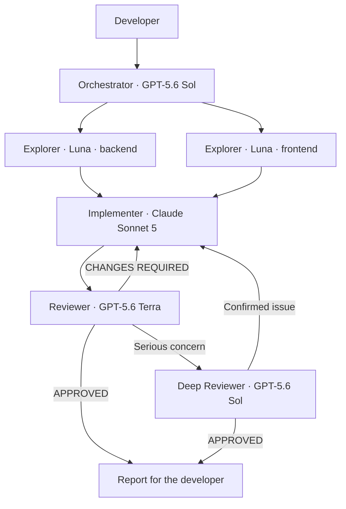

# Copilot Engineering Team

Version 1 of a GitHub Copilot agent team configuration for VS Code, targeting **FastAPI + React/Next.js + TypeScript** projects. This repository provides a ready-to-use `.github/` directory for an existing application. It does not include backend or frontend application code.



The arrows show the workflow; Orchestrator handles all delegation. Explorer can analyze independent areas in parallel. Only one Implementer runs at a time, and review starts after editing and validation are complete.

## Contents

| Component | Purpose |
| --- | --- |
| [copilot-instructions.md](.github/copilot-instructions.md) | Concise shared rules |
| [.github/instructions/](.github/instructions/) | Path-specific rules for Python, TypeScript/TSX, and tests |
| [.github/agents/](.github/agents/) | Five roles with configured models and tool lists |
| [.github/skills/](.github/skills/) | Feature analysis, bug investigation, validation, and review loaded on demand |
| [.github/prompts/](.github/prompts/) | Three entry-point commands for developers |
| [.vscode/settings.json](.vscode/settings.json) | Terminal auto-approval and nested subagents disabled |
| [docs/benchmark.md](docs/benchmark.md) | A/B comparison procedure and metric definitions |
| [docs/benchmark-results.csv](docs/benchmark-results.csv) | Ten unmeasured records for five tasks across two variants |
| [docs/demo.md](docs/demo.md) | First-run checks and presentation scenario |
| [scripts/validate_config.py](scripts/validate_config.py) | YAML, reference, and role-boundary validation |

## Set up in your project

1. Open the target application's root directory in VS Code with GitHub Copilot working and access to the required models.
2. Copy the contents of `.github/` into the application. If files already exist, merge their contents while preserving project rules and other files, such as workflows.
3. In `copilot-instructions.md`, replace the first bullet with a description of the application and specify the actual backend/frontend directories. Adapt the instructions to the libraries in use; RTK Query rules apply only if the project uses it. Add known validation commands and working directories from the project manifests.
4. Merge the two settings from `.vscode/settings.json`. Use standard tool approvals, without Bypass Approvals/Autopilot. Organization policies take precedence.
5. Open the `.agent.md` files and check the `model` field using VS Code suggestions. Keep the specified models if your account has access; otherwise, explicitly choose an allowed equivalent and record the change. Keep the reviewer on a different model from the implementer for independent review.
6. In local Chat, select **Orchestrator**. The other four roles are intentionally hidden from the picker. Check the coordinator's tools: `agent`, `read`, `search`.
7. Run the first check described in the [demo](docs/demo.md), then try a task in the actual application.

You can edit the configuration without the Preview Customizations editor. Agents are defined in `.agent.md` files; Chat diagnostics can verify that they are discovered. [Custom agents documentation](https://code.visualstudio.com/docs/agent-customization/custom-agents).

**Important for VS Code 1.136:** `.prompt.md` files work with local agents in the **extension host**. Sessions running on **Agent Host** do not use prompt files. In those sessions, select Orchestrator and enter the full request; skills remain a separate mechanism. [Prompt files documentation](https://code.visualstudio.com/docs/agent-customization/prompt-files).

## Examples

After selecting Orchestrator:

```text
Add filtering by validation status.
Keep API backwards compatible.
Cover the backend contract and frontend filter behavior with tests.
```

In local Chat with prompt file support:

```text
/implement-feature Add a validation status filter. Without a filter, the API must preserve its existing behavior.
/investigate-bug Changing the filter on the second page returns an empty result. Identify the cause without applying a fix.
/review-change Review the current working-tree changes related to the status filter.
```

You can also invoke `/feature-analysis`, `/bug-investigation`, `/run-validation`, or `/code-review`. Skills are available on demand and do not change the active role's permissions; Orchestrator delegates work that requires terminal access. [Skills documentation](https://code.visualstudio.com/docs/agent-customization/agent-skills).

## Models and costs

| Role | Model configured in v1 | Tools |
| --- | --- | --- |
| Orchestrator | GPT-5.6 Sol | read, search, agent |
| Explorer | GPT-5.6 Luna | read, search |
| Implementer | Claude Sonnet 5 | read, search, edit, execute |
| Reviewer | GPT-5.6 Terra | read, search, execute |
| Deep Reviewer | GPT-5.6 Sol | read, search, execute |

These names preserve the model choices from the solution design. Availability depends on the account, client, and organization policies; the public list does not confirm access for a particular account. [Models supported by Copilot](https://docs.github.com/en/copilot/reference/ai-models/supported-models).

Subagents have separate context. According to the documentation, a subagent's model cannot exceed the main model's cost tier; an unavailable configuration should be reported as a blocker rather than silently substituting a role. Verify the actual model used for each invocation in your session. [Subagents documentation](https://code.visualstudio.com/docs/agents/run/subagents).

Version 1 has no automatic Astra/Opus role. You manually initiate exceptionally difficult architecture analysis. Context and reasoning remain at their standard defaults; the configuration does not force a 1M context window or high reasoning effort. API prices are not recorded as Copilot costs: the benchmark measures actual account usage.

## Permissions and completion

- Orchestrator has neither `edit` nor `execute`; it delegates only to the four specified roles. Explorer has no terminal or editing tools.
- Reviewer and Deep Reviewer have terminal access for inspection and tests. **This is not a technically enforced read-only sandbox**: the terminal can write files. Instructions prohibit editing, auto-fix, and snapshot updates; commands still require oversight.
- Terminal auto-approval is disabled by default. Add any rules for pytest/Ruff/mypy/npm only after checking the actual project scripts and company policies. The `npm test` prefix alone does not guarantee the absence of side effects. [Tool approvals](https://code.visualstudio.com/docs/agents/run/approvals).
- There are no automatic commits, pushes, deployments, resets, or production configuration changes. Version 1 does not configure MCP.
- After a failed review, the coordinator sends findings back for fixes and another review. After two unresolved repair rounds, it reports `BLOCKED`. Missing required tests or tools also prevents `DONE`.
- The configuration describes a workflow directed by a model; it is not a deterministic execution engine. The developer must verify the result.

## Validate this repository

Python 3.10+ is required for validation. PyYAML is a dependency of the validator only; it is not required to use Copilot.

Windows / PowerShell, from the repository root:

```powershell
python -m venv .venv
.\.venv\Scripts\python.exe -m pip install -r requirements-dev.txt
.\.venv\Scripts\python.exe scripts/validate_config.py
```

Linux / macOS:

```bash
python3 -m venv .venv
.venv/bin/python -m pip install -r requirements-dev.txt
.venv/bin/python scripts/validate_config.py
```

The validator checks frontmatter, agent names and references, tool boundaries, instruction globs, skill metadata, the absence of prompt tool/model overrides, and terminal settings. It does not confirm model availability, Copilot runtime behavior, instruction effectiveness, or application code quality. A full POC requires a VS Code session and five real tasks; benchmark measurements are initially blank.
