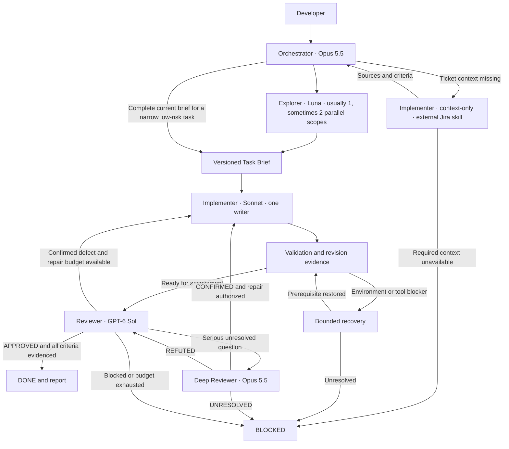

# Copilot Engineering Team v4

A GitHub Copilot configuration for VS Code and existing **FastAPI + React/Next.js + TypeScript** applications. It includes configuration, validation and an isolated **Incident Desk benchmark application**.

V4 assigns Opus 5.5 to coordination, GPT-6 Luna to exploration, Sonnet 5 to implementation and GPT-6 Sol to independent review. It adds a reproducible benchmark against standard Agent Mode. The workflow contract remains version 3, including optional external Jira intake on Windows. The personal skill and helper stay outside this repository. One role writes; independent review decides whether the complete change is acceptable.


```mermaid
flowchart TD
    U[Developer] --> O[Orchestrator · Opus 5.5]
    O -->|Ticket context missing| J[Implementer · context-only · external Jira skill]
    J -->|Sources and criteria| O
    J -->|Required context unavailable| X[BLOCKED]
    O --> E[Explorer · Luna · usually 1, sometimes 2 parallel scopes]
    E --> B[Versioned Task Brief]
    O -->|Complete current brief for a narrow low-risk task| B
    B --> I[Implementer · Sonnet · one writer]
    I --> V[Validation and revision evidence]
    V -->|Ready for assessment| R[Reviewer · GPT-6 Sol]
    V -->|Environment or tool blocker| F[Bounded recovery]
    F -->|Prerequisite restored| V
    F -->|Unresolved| X[BLOCKED]
    R -->|APPROVED and all criteria evidenced| D[DONE and report]
    R -->|Confirmed defect and repair budget available| I
    R -->|Serious unresolved question| DR[Deep Reviewer · Opus 5.5]
    DR -->|CONFIRMED and repair authorized| I
    DR -->|REFUTED| R
    DR -->|UNRESOLVED| X
    R -->|Blocked or budget exhausted| X
```

Arrows describe the workflow: Orchestrator performs all delegation. Ticket intake is a read-only assignment before repository analysis and implementation, not a second writer. Investigation-only and review-only requests use their own shorter routes. Validation normally runs inside the implementation invocation. A deep result never approves the full change.

## Components

| Component | Purpose |
| --- | --- |
| [Shared instructions](.github/copilot-instructions.md) | Architecture, evidence reuse and safety |
| [Path instructions](.github/instructions/) | Backend, frontend and test conventions |
| [Agents](.github/agents/) | Five roles and minimal tool sets |
| [Workflow contract](.github/agents/contracts/workflow.md) | Task Brief, result formats, revision evidence, severity and statuses |
| [Ticket contract](.github/agents/contracts/ticket-context.md) and [Windows guide](docs/jira-integration.md) | External personal Jira skill, context-only intake and requirement provenance |
| [Skills](.github/skills/) | Analysis, investigation, validation and review procedures |
| [Prompts](.github/prompts/) | Feature, ticket, investigation and review entry points |
| [Settings](.vscode/settings.json) | No terminal auto-approval or nested delegation |
| [Validator](scripts/validate_config.py) and [tests](tests/test_validate_config.py) | Static contract regression checks |
| [CI](.github/workflows/validate-config.yml) | Static checks on Linux/Windows and application baseline tests/build on Linux; no Jira access |
| [Demo](docs/demo.md) and [scorecard](docs/demo-scorecard.md) | Runtime checks and an evidence-led presentation |
| [Observability](docs/observability.md) | Local traces, model routing and cost evidence |
| [Incident Desk benchmark](benchmark/README.md), [task](benchmark/task.md) and [assessor](benchmark/assessor/README.md) | Reproducible A/B application, frozen criteria and independent checks |
| [CSV](benchmark/results.csv) or [Excel tracker](outputs/benchmark-tracker.xlsx) | Three planned pairs, with measurements initially blank |
| [Benchmark methodology](docs/benchmark.md) and [detailed worksheet](docs/benchmark-results.csv) | Broader real-application measurements and optional detailed traces |
| [Design decisions](docs/team-design.md) and [presentation plan](docs/presentation-plan.md) | Shared reasoning and a 5–10 minute presentation after actual measurements |
| [Experiments](docs/experiments.md) | Optional cheaper-model trials; no production routing changes |

## Install or upgrade in an application

1. Open the application root with Copilot and the required models available.
2. Merge only these distributable paths: `.github/copilot-instructions.md`, `.github/instructions/`, `.github/agents/` (including `contracts/`), `.github/skills/`, and `.github/prompts/`. Preserve existing rules and customizations. Do not copy this template's maintenance workflow unless also adopting its scripts, tests and documentation.
3. Replace the template architecture bullet with real application directories. Adapt path globs and conventions; FastAPI rules apply only where those libraries are used. Record known validation commands and cwd from actual manifests.
4. Merge the [workspace settings](.vscode/settings.json), including subagent credit visibility. Use standard approvals rather than Bypass Approvals/Autopilot. Organization policy takes precedence.
5. Check model names through VS Code suggestions and actual invocations. All configured fallbacks are initially disabled; adapting the model policy requires a conscious configuration change and runtime verification.
6. Select **Orchestrator**, whose only tool is `agent`. Other roles are hidden from the picker. If the shared contract is not injected into context, the first reader returns coordination rules alongside its result: Implementer for ticket intake, otherwise Explorer/Reviewer. This requires no separate bootstrap call.
7. Run the [first-run scenarios](docs/demo.md) after installation, changes to models/tools, or a harness upgrade. Do not repeat setup checks for every task.

V4 upgrades from v3 by changing the agent model assignments and enabling subagent credit visibility. Preserve the existing workflow/ticket contracts, role permissions and attempt budgets. Runtime-check the newly configured models; configuration validation does not prove they are available on the account.

V1 migration replaces role/skill/prompt contents, adds the shared contract and removes Orchestrator's read/search tools. Keep the existing approval settings. No new agent or Test Agent is needed.

From v2, merge the updated workflow/agent definitions and four prompts, including `implement-ticket`, plus the new ticket contract. For ticket tasks follow the [Windows integration guide](docs/jira-integration.md). Keep your personal `jira` skill/helper, company configuration and credentials outside the repository. Plain-text tasks have no Jira dependency.

Custom-agent availability depends on the account, client and organization. Verify discovery and effective tools in Chat diagnostics. [Custom agents](https://code.visualstudio.com/docs/agent-customization/custom-agents).

Prompt files work with local extension-host agents; Agent Host sessions do not use them. There, select Orchestrator and enter the full request. Do not assume a slash command ran the team. [Prompt files](https://code.visualstudio.com/docs/agent-customization/prompt-files).

## Usage

With Orchestrator selected:

```text
Add filtering by validation status in the API and UI.
Omitting the filter must preserve existing behavior.
Changing the filter must reset pagination.
Cover meaningful backend and frontend behavior with tests.
```

Where prompt files are supported:

```text
/implement-feature Add status filtering while preserving API compatibility.
/implement-ticket <YOUR_TICKET_KEY> Preserve API compatibility.
/investigate-bug Changing a filter on page two returns an empty list. Diagnose only.
/review-change Review the current working-tree status-filter changes without fixes.
```

Skills are procedures, not additional roles or tool grants. A command requiring execution is delegated to an execution-capable role.

## Models, context and credits

| Role | Default model | Tools |
| --- | --- | --- |
| Orchestrator | Claude Opus 5.5 | agent |
| Explorer | GPT-6 Luna | read, search |
| Implementer | Claude Sonnet 5 | read, search, edit, execute |
| Reviewer | GPT-6 Sol | read, search, execute |
| Deep Reviewer | Claude Opus 5.5 | read, search, execute |

Explicit model selection for a Local subagent cannot exceed its parent's cost category. Opus 5.5 supports the full configured chain, including deep review; changing the coordinator to Luna is not an equivalent cheaper configuration. Invocations are stateless, so repairs need the relevant prior brief and delta. [Subagents](https://code.visualstudio.com/docs/agents/run/subagents).

Prefer Luna for scoped exploration, compact sourced handoffs, reuse of applicable checks, and fewer unnecessary invocations. Parallelism can reduce latency while increasing token usage. Independent Reviewer reads are useful verification, not automatically waste.

Fallback lists are availability preferences, not automatic recovery after partial writes. Before enabling one, smoke-test it, add it to `APPROVED_FALLBACKS` and `MODEL_TIERS` in the validator, then configure at most one alternative in that role's model list. Every possible parent must support the entire child chain; every possible reviewer/deep-reviewer model must differ from every possible implementer model. No fallback is pre-approved in v4.

Use actual Copilot account/session usage, not guessed request multipliers or agent self-reports. Current token/cache pricing is maintained by GitHub; this template does not hardcode prices. [Copilot pricing](https://docs.github.com/en/copilot/reference/copilot-billing/models-and-pricing).

## Completion and safety

The [contract](.github/agents/contracts/workflow.md) distinguishes confirmed defects (CHANGES REQUIRED), unavailable required evidence (BLOCKED), and serious unresolved questions (DEEP REVIEW REQUIRED). DONE requires all criteria evidenced, required checks passing for the current state and the complete review APPROVED.

Orchestrator owns a ledger: two repair rounds, at most one retry per failed operation within two total recovery attempts, one deep review and one supplementary research pass. A stalled operation stops early; a fresh invocation does not reset counters. These are model-directed rules, not hard runtime limits.

No automatic commits, pushes, deployments, resets or production changes. Reviewer terminals are **not technically read-only sandboxes**; tool approvals and instructions still matter. Do not broadly auto-approve a test-command prefix without inspecting its scripts.

## Run the concrete benchmark

Follow the [Polish step-by-step guide](benchmark/README.md). From this repository root:

```sh
python scripts/prepare_benchmark.py --destination ../ghcp-benchmark-pair-01 --init-git
```

The script creates new A/B application workspaces and a baseline manifest. The explicit `--init-git` option creates local baseline commits only in those new workspaces. It never overwrites an existing destination or changes this repository's history. Open each workspace in its own VS Code window, perform setup before timing, then paste the identical [task](benchmark/task.md). The assessor stays outside both agent workspaces.

Record real credits, time, externally assessed defects and code quality in the [CSV](benchmark/results.csv) or [Excel tracker](outputs/benchmark-tracker.xlsx). These contain planned runs, not performance measurements. The later [5–10 minute presentation](docs/presentation-plan.md) will use the collected results.

## Validate this template

Python 3.10+ and [PyYAML](requirements-dev.txt) are maintenance dependencies, not prerequisites for using the copied agents.

Linux/macOS, from the repository root:

```sh
python3 -m venv .venv
.venv/bin/python -m pip install -r requirements-dev.txt
.venv/bin/python scripts/validate_config.py
.venv/bin/python -m unittest discover -s tests -v
```

Windows/PowerShell:

```powershell
python -m venv .venv
.\.venv\Scripts\python.exe -m pip install -r requirements-dev.txt
.\.venv\Scripts\python.exe scripts/validate_config.py
.\.venv\Scripts\python.exe -m unittest discover -s tests -v
```

The validator checks metadata, role/model permissions, fallback compatibility, protocol enums, external-intake boundaries, links, settings and worksheet structure. Negative tests mutate disposable copies. It neither reads the external skill nor connects to Jira. It does not prove prose effectiveness, glob coverage in a consuming application, runtime model/skill availability, independence in an actual review or application correctness. Those require the documented VS Code scenarios and real benchmark runs.
